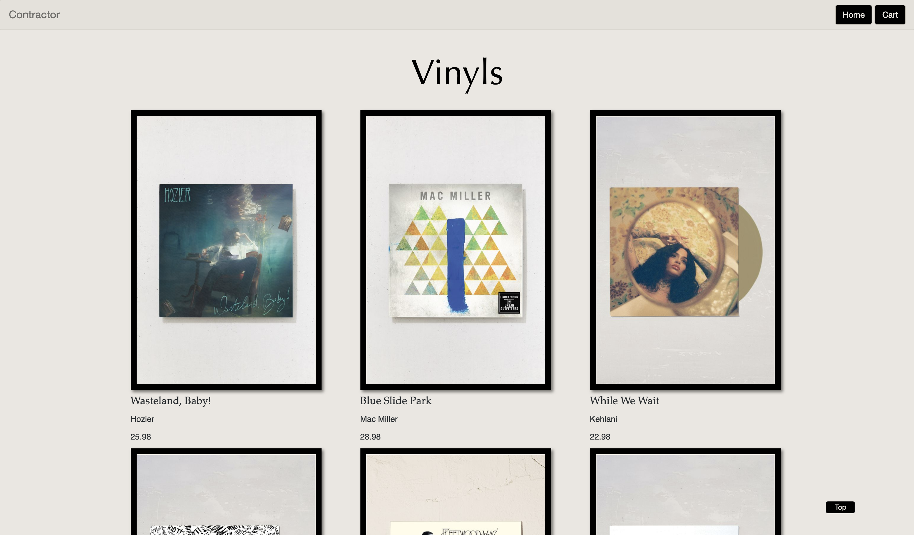

# Contractor Assignment
A simple e-commerce website

## Preview

## Outline
A web application selling vinyls using back-end technologies including Python, Flask, & MongoDB and front-end technologies including HTML, CSS, & Bootstrap. 
 Deployed to Heroku.
 Design inspired by UrbanOutfitters.com

## Demo It!
[https://contractor-cc.herokuapp.com/]

## Project Specs
https://docs.google.com/document/d/1C8eOyLBeGMKJ2y50QwLU5tWjNb2JVcpAE4khUBIfm0U/edit
